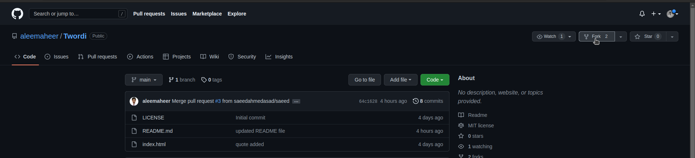
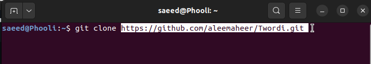
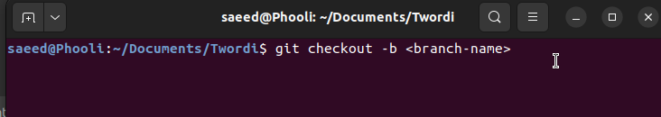
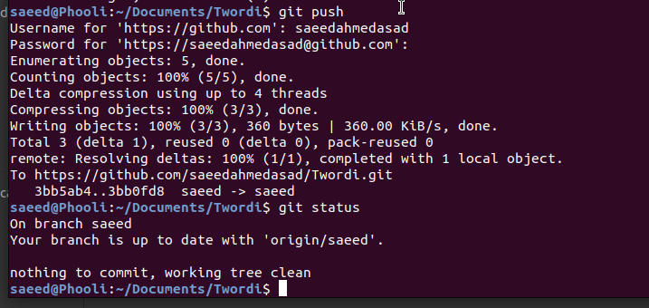
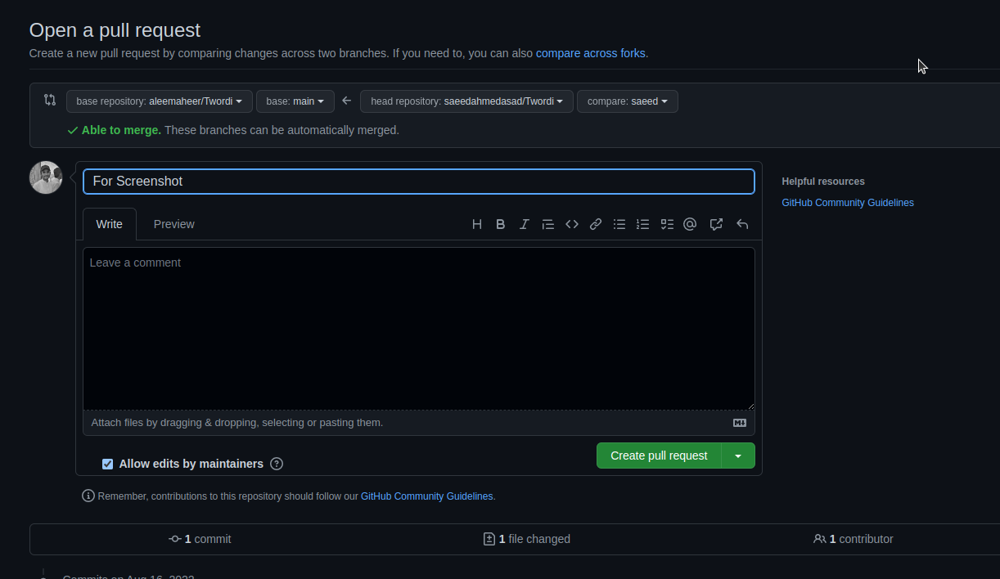

# **TWORDI**

## TWORDI is the online and **_Open Source_** web app. TWORDI is basically focused on

> Online **_Typing Games_**

> and **_Much More_** has to **_come_**

---

---

# You can **Contribute** to **TWORDI**

Following are the steps that show how you can **Contribute**:

- First **Fork** the Twordi Repository
- Clone the Repository in your PC/Laptop
- Then run **git checkout -b < branch-name>**
- Confirm Your Changes and **Push**
- Raise a **Pull Request**

---

# Visual **Represetation**

**Step 1** **_FORKING_**

    

**Step 2** **CLONING REPO**

    

**Step 3** **BRANCHING**

    

**Step 4** **PUSHING**

    

**Step 5** **PULL REQUEST**

    

